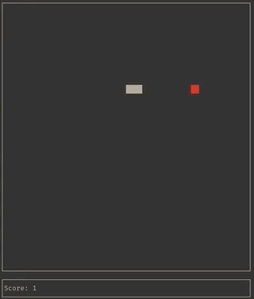

# cppSnake

Snake game written in C++ using the ncurses library. Pretty self-explanitory.

### Instructions

To compile simply type `make` into your terminal. The executable will be saved under `main`. Alternatively type `make run` to directly get into the game.    
There are additional arguments which allow you to override the width, height, and speed of the game (see `./main --help` or `./main -h`), but I think the default values are pretty good as is.

### Controls

<kbd>↑</kbd> / <kbd>w</kbd> to move up    
<kbd>↓</kbd> / <kbd>s</kbd> to move down    
<kbd>←</kbd> / <kbd>a</kbd> to move left  
<kbd>→</kbd> / <kbd>d</kbd> to move right  
<kbd>p</kbd> to pause the game (can be resumed by pressing any key)  
<kbd>0</kbd> to quit the game  

